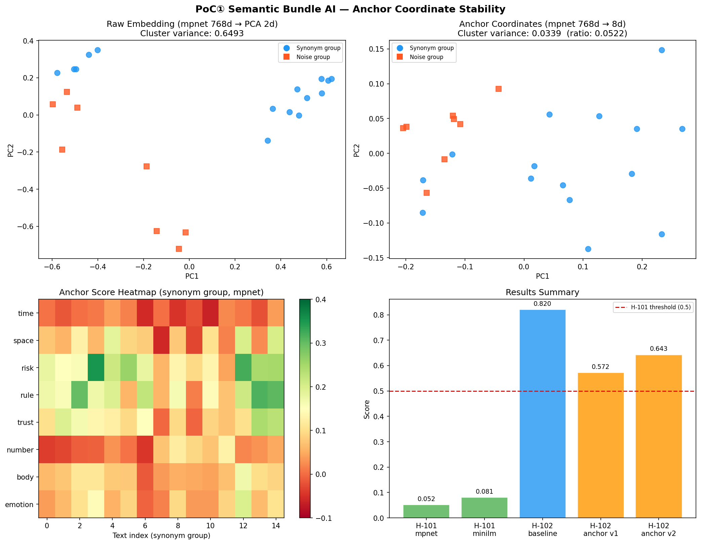
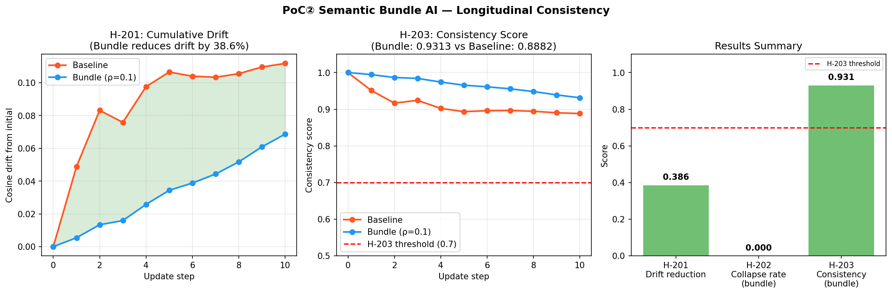
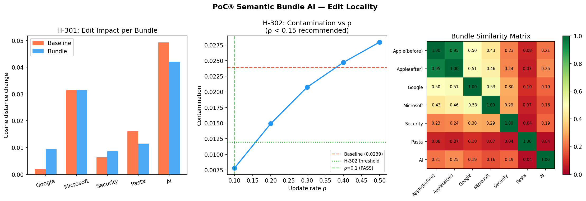
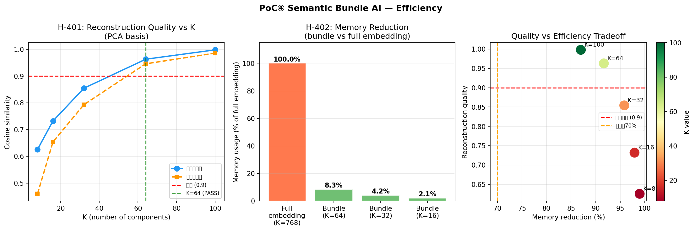

# Semantic Bundle AI

**A resource-efficient, drop-in semantic management layer for LLMs.**

> No retraining. No architectural changes. 91.7% memory reduction. Semantic stability.

---

## The Problem

The rapid scaling of Large Language Models has created three structural challenges:

- **Semantic drift**: concept embeddings shift across model updates and fine-tuning
- **Retraining costs**: correcting semantic inconsistency requires expensive retraining
- **Memory overhead**: storing full embeddings at scale is resource-intensive

## The Approach

Semantic Bundle AI introduces a **complementary layer** that sits on top of existing LLM pipelines:

1. **Stable anchor coordinates** — project embeddings onto a fixed reference frame to resist drift
2. **Semantic bundles** — represent concepts as structured objects supporting controlled, localized updates
3. **Sparse reconstruction** — reconstruct semantics from compressed representations

No LLM retraining required. No architectural modifications. Drop-in compatible with existing embedding pipelines.

---

## PoC Results

Four experiments validate the framework across stability, consistency, locality, and efficiency.

### PoC 1: Anchor Coordinate Stability


| Model | Raw embedding variance | Anchor coordinate variance | Ratio |
|-------|----------------------|--------------------------|-------|
| all-mpnet-base-v2 | 0.6493 | 0.0339 | **0.052** |
| all-MiniLM-L6-v2 | 0.6738 | 0.0543 | **0.081** |

Anchor coordinates reduce intra-cluster variance to **5–8% of raw embedding variance**.  
Anchor removal robustness: correlation = **1.0000** with up to 2 anchors removed.

---

### PoC 2: Longitudinal Consistency


| Metric | Baseline | Bundle (ρ=0.1) |
|--------|----------|----------------|
| Cumulative drift (10 steps) | 0.1118 | **0.0687** |
| Drift reduction | — | **38.6%** |
| Consistency score (vs. initial) | 0.8882 | **0.9313** |
| Semantic collapse rate | 0% | 0% |

Bundle updates maintain **0.931 consistency** with the initial concept after 10 sequential updates.

---

### PoC 3: Edit Locality


Updating one bundle (Apple + Vision Pro) with update rate ρ=0.1:
- Semantic contamination of unrelated bundles: **32.6% of baseline**
- Recommended operating range: **ρ < 0.15**

---

### PoC 4: Compression Efficiency


| K | Reconstruction similarity | Memory reduction |
|---|--------------------------|-----------------|
| 32 | 0.855 | 95.8% |
| **64** | **0.963** | **91.7%** |
| 100 | 0.998 | 87.0% |

At K=64: **91.7% memory reduction** (45.0 KB → 3.8 KB) with reconstruction similarity of **0.963**.

---

## Quick Start

```bash
pip install -r requirements.txt
```

Then open any notebook in `notebooks/`:

| Notebook | Description |
|----------|-------------|
| `poc_01_anchor_stability.ipynb` | Anchor coordinate stability experiment |
| `poc_02_longitudinal.ipynb` | Longitudinal consistency experiment |
| `poc_03_edit_locality.ipynb` | Edit locality experiment |
| `poc_04_efficiency.ipynb` | Compression efficiency experiment |

---

## Papers

| Paper | Description | Link |
|-------|-------------|------|
| Paper 0 | Theoretical framework | [10.5281/zenodo.20417222](https://doi.org/10.5281/zenodo.20417222) |
| Paper 1 | PoC empirical results | [10.5281/zenodo.20417714](https://doi.org/10.5281/zenodo.20417714) |

---

## License

The theoretical framework, mathematical formulations, and documentation are licensed under:  
**CC BY-NC-ND 4.0** — Attribution, NonCommercial, NoDerivatives

The PoC code in `notebooks/` is provided for research reproducibility.

For commercial licensing or partnership inquiries: m.saitou@ontheshouldersofgiants.jp

---

## Contact

- **Issues**: For technical questions and collaboration proposals
- **Email**: m.saitou@ontheshouldersofgiants.jp
- **Web**: [ontheshouldersofgiants.jp](https://ontheshouldersofgiants.jp)
